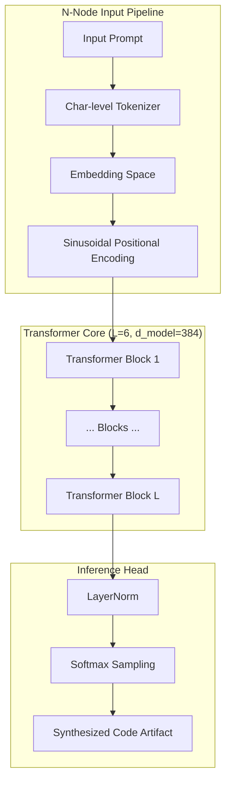
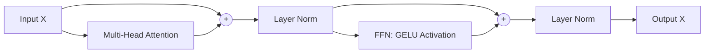

# Moshi: A Federated Neural Engine for Modern Code Synthesis

Moshi isn't just another editor; it's a project I started to explore a decentralized future for AI. It's a character-level transformer trained to live on the edge, learning and evolving alongside you without the overhead of massive, disconnected cloud models.

## 🏛 The Mission

The goal was to build a synthesis engine that understands **syntax grammar** rather than just memorizing templates. By utilizing a federated synchronization protocol, Moshi allows local development nodes to form a collective "Global Brain."

### Why Another IDE?
Most tools treat your code as static data. Moshi treats it as a living language. Every generation on your machine refine's its local weights, which you can then contribute back to the community via our Federated Integration Hub.

### 1. Neural Compute Flow
The synthesis process follows a strictly causal sequence:



### 2. The Internal Block Geometry
Each `TransformerBlock` is a high-fidelity unit defined by:
$$ \text{LayerNorm}(x + \text{Attention}(x)) $$
$$ \text{LayerNorm}(x + \text{GELU}(xW_1 + b_1)W_2 + b_2) $$



## 🌐 Federated Learning Protocol (FL-Moshi)

Moshi employs a **Decentralized Parameter Synchronization** method. Local model refinements are merged into a global weight vector through a Git-based consensus hub.

### The Optimization Loop
The objective function $\mathcal{L}$ is minimized using the **AdamW** optimizer with a **One-Cycle Learning Rate** schedule, ensuring rapid convergence on edge hardware:

$$ W_{t+1} = W_t - \eta_t \frac{\hat{m}_t}{\sqrt{\hat{v}_t} + \epsilon} $$

where $\eta_t$ follows the $1$-cycle trajectory, optimizing for both exploration and exploitation phases during local training sessions.

## 🚀 Deployment & Scaling

### Performance Specifications
- **Vocab Size:** Dynamically scaled $\approx 100$ (Character-level)
- **Sequence Context:** $384$ tokens (Edge Optimized)
- **Floating Point:** FP32/BF16 compatible
- **Concurrency:** Multi-threaded backend with `R/W` Model Lock

### Initialization Strategy
```bash
git clone https://github.com/aliyabuz25/Moshi.git
python3 server.py
```

Upon startup, the **SyncManager** initializes a cold-start pull from the Global Brain Hub, ensuring your local node is synchronized with the latest community-validated parameters.

---
**Elite Engineering Context.**  
[Architecture Details](https://github.com/aliyabuz25/Moshi) | **Moshi Open Research**
