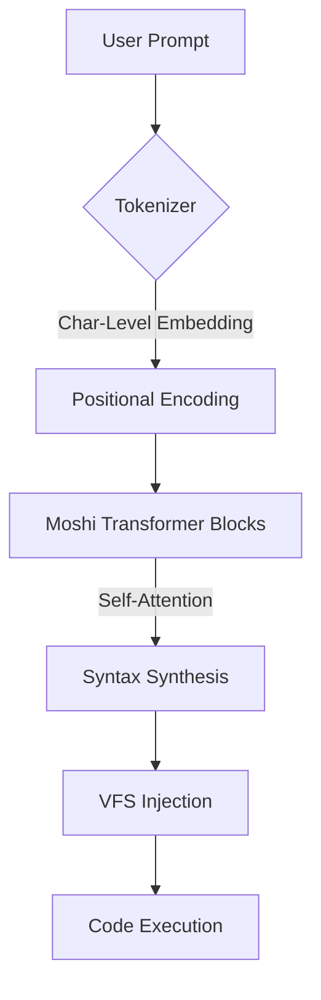
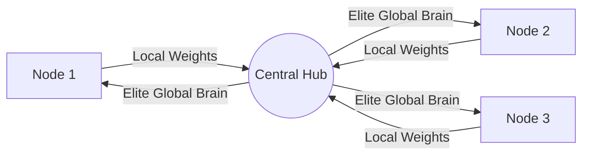

# Moshi: The Story of a Decentralized Coding Brain

Moshi started with a simple question: *What if our IDEs didn't just suggest code, but actually learned the "soul" of every project they touched?*

Most AI coding assistants feel like black boxes—disconnected, gargantuan models that eat your data and give back generic templates. Moshi is different. It’s a decentralized, state-aware neural engine that lives on your machine, learns from your unique syntax, and contributes back to a global collective intelligence.

## � How Moshi "Thinks"

At its core, Moshi isn't memorizing your files. It’s analyzing the **atomic grammar** of your project—the way you nest your HTML, the specific animations you prefer in CSS, and the async patterns you use in JS.

### The Neural Flow


### The "Global Brain" Synchronization
Moshi uses a federated learning approach. Every time it helps you solve a problem, it appends that new pattern to its local memory. When you sync, your machine votes on the future of the global model.



## 🛠 Tech Stack (For the Curious)

- **Back-end:** Python 3.10+ / Flask / PyTorch
- **Visuals:** Inter & JetBrains Mono / Custom Monaco Theme
- **Sync Engine:** Git-based Federated Learning Hub
- **Syntax Engine:** Character-level Transformer with logic-based prompt mapping.

## � Getting Started

If you're reading this, you're likely here to build something smarter. To get the engines running:

1. **Clone the Repo:**
   ```bash
   git clone https://github.com/aliyabuz25/Moshi.git
   ```
2. **Ignite the Brain:**
   ```bash
   python3 server.py
   ```
3. **The First Sync:**
   Hit the **"Global Sync"** button in Moshi. This will pull the latest weights (`moshi_brain.pt`) and shared knowledge from the community.

## � The Roadmap

Moshi is an evolving organism. Our current focus is on **Edge-Optimization** (making it faster on every CPU) and **Zero-Shot Project Context** (understanding your whole codebase in a single blink).

---
**Build with us.**  
[Github](https://github.com/aliyabuz25/Moshi) | **Moshi Community**
