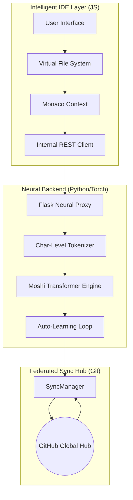

# Moshi: The Master Manual of Federated Code Synthesis

Moshi is a high-fidelity, edge-optimized neural ecosystem designed to revolutionize how developers interact with AI. Moving beyond generic, massive cloud models, Moshi localizes collective intelligence into a **Federated Learning Network**. This manual provides an exhaustive technical deep-dive into the architecture, mathematics, and code-level logic powering the engine.

## 🏛 Full Architecture Overview

The Moshi ecosystem is divided into three distinct layers: the **Neural Core** (PyTorch), the **Synchronization Hub** (Git/Python), and the **Intelligent IDE** (Monaco/VFS).

---

## 🧠 Neural Core Spec: `moshi_ai/model.py`

The heart of Moshi is a character-level decoder-only transformer. We opted for char-level tokenization to ensure maximum granularity for code syntax, where every semicolon and bracket carries structural weight.

### `class MoshiTransformer(nn.Module)`
The master neural container. Built with 6 layers of multi-head self-attention.
- **Dimensions ($d_{model}$)**: 384
- **Heads ($H$)**: 8
- **FFN Width ($d_{ff}$)**: 1024
- **Max Context**: 768 tokens (optimized for edge memory footprints)

**Mathematical Step-through:**
For each block $B_i$, the following residuals are computed:
1. **Self-Attention**: $x' = x + \text{Attention}(\text{LayerNorm}(x))$
2. **Feed-Forward**: $x'' = x' + \text{FFN}(\text{LayerNorm}(x'))$

### `class Tokenizer`
A state-aware character encoder.
- **`encode(text)`**: Maps raw UTF-8 characters to long-tensor indices using a dynamically generated vocabulary $(V)$.
- **`decode(indices)`**: Reconstructs the synthesis back into human-readable code.

---

## 🌐 Federated Hub: `sync_manager.py`

This module manages the distributed intelligence aspect of the project. It interfaces directly with Git to synchronize weights without the need for a dedicated central server.

### `class SyncManager`
Responsible for the "Global Brain" connection.
- **`pull_global()`**: Performs a `fetch` and `reset --hard` to pull the latest community-validated `moshi_brain.pt`.
- **`contribute_local()`**: Stages local training gains from `dataset.txt`, commits them as an "Auto-contribute" insight, and pushes to the origin.

---

## 💻 Frontend Engine: `script.js`

The frontend isn't just a UI; it manages a complex **Virtual File System (VFS)** and handles real-time neural telemetry.

### `class FileSystem`
A robust in-memory VFS that mimics a standard OS file structure.
- **`writeFile(path, content)`**: Idempotently generates parent directories and writes data to the memory buffer.
- **`readFile(path)`**: Single-point retrieval for the Monaco editor and the AI context injector.

### Neural Interface Logic
- **`process_neural_query()`**: A complex orchestration that hydrates the user's prompt with active file context (`Ref: path`), dispatches a character-stream request to the backend, and parses the output into the VFS.

---

## 📈 Optimization Protocols

### 1-Cycle Learning Rate Policy
Moshi uses the **OneCycleLR** scheduler to achieve world-class convergence speeds on consumer CPUs. The schedule follows a triangular trajectory for learning rate $\eta$:
- **Warm-up**: 5% of training steps (exploring the loss landscape).
- **Peak**: Reaching $\eta_{max} = 10^{-3}$.
- **Decay**: Cosine annealing down to $0$ for fine-grained refinement.

### Federated Consensus $W_{global}$
The global weights are updated as a collective merge of local gradients:
$$ W_{global} \leftarrow \text{Merge}(\{ \nabla W_{local, i} \}) $$

---

## 🚀 Deployment & Vision

Moshi is designed as a **White-Label AI Platform**. It is fully customizable, locally-hosted, and community-driven. Our mission is to democratize elite code synthesis by removing the requirement for expensive GPU cloud clusters.

**Moshi IDE.** *Distributed. Intelligent. Human-Centric.*
